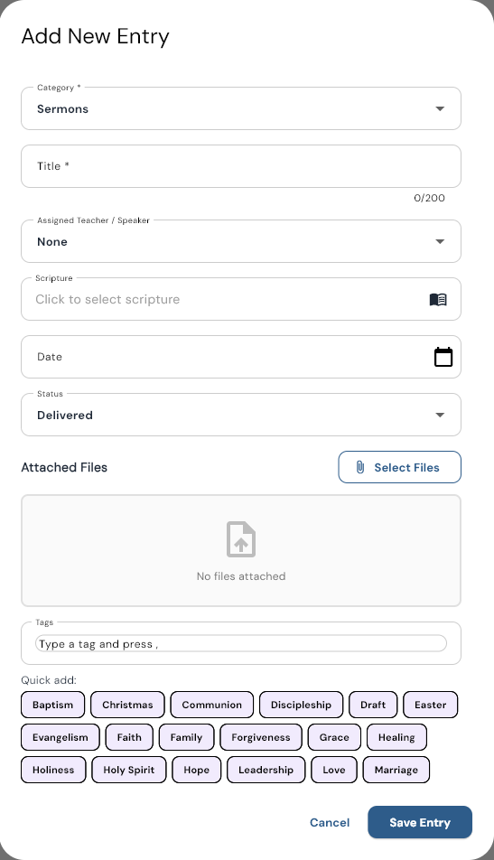
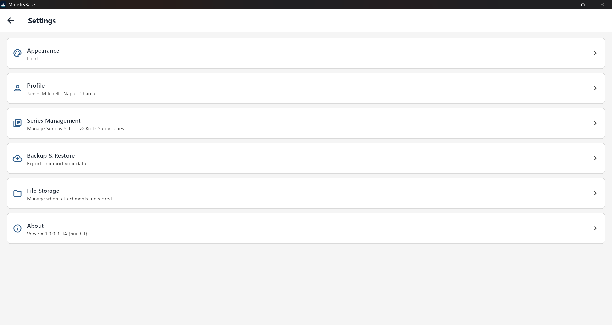

# MinistryBase

**A simple Windows app that keeps a pastor's sermons, lessons, and articles in one place.**

MinistryBase gives you one searchable library for everything you teach and write: Sunday morning sermons, Sunday School lessons, Wednesday Bible Study lessons, and newspaper or paper articles. Everything stays on your own computer. There is no cloud account to create and no subscription to manage.

## What you can do

- **Keep one library.** Add each sermon, lesson, or article with a title, date, scripture, and tags. Browse by type, filter by tag, or type a few words into the search box to find a title, scripture reference, or tag.
- **Attach your files.** Attach your Word documents, PDFs, and other files to an entry so your notes and manuscripts are always one click away.
- **Organize by series.** Group Sunday School and Bible Study lessons into series and number them.
- **Use the calendar.** See your entries on a month or two-week calendar, and set up recurring weekly services so they show up automatically.
- **Keep a member directory.** Store your members' contact details and use them when picking a teacher or speaker.
- **Keep your data safe.** Your data lives in a folder on your PC. Each time something is saved, MinistryBase keeps a dated backup copy, and it holds on to the 10 most recent. You can also export a full backup (a single zip file with your entries and attached files) and import it again later.

## Screenshots

## System requirements

- Windows 10 or Windows 11, 64-bit
- Enough free disk space for the app and your attached files
- No internet connection needed

## Download

Get the installer from the **[Releases page](https://github.com/jmitchell238/MinistryBase-releases/releases)**.

The first public release is coming soon. To hear when it is ready, join the waitlist at **[ministrybase.app](https://ministrybase.app)**.

## Installing

1. Download the installer (a file named like `MinistryBaseSetup_v1.0.0.exe`) from the Releases page.
2. Double-click the file and follow the prompts. You will be asked to accept the license agreement, and Windows may ask for permission to install.
3. Open MinistryBase from the Start menu and add your first entry.

**A note about Windows SmartScreen:** The installer is not yet code-signed, so Windows may show a blue box that says "Windows protected your PC." This is expected. Click **More info**, then click **Run anyway**.

## Updating

Download the newest installer and run it right over the old version. You do not need to uninstall first, and your data is safe. See [UPDATING.md](UPDATING.md) for details.

## Privacy

Your sermons, calendar, and members stay on your computer. MinistryBase does not send your content anywhere and contains no analytics or advertising. See [PRIVACY.md](PRIVACY.md).

## License

MinistryBase is proprietary software, provided free for personal and church use. See [LICENSE.md](LICENSE.md).

## Contact

Questions or feedback: [support@238apps.com](mailto:support@238apps.com)

---

Made by [238 Apps](https://238apps.com)
