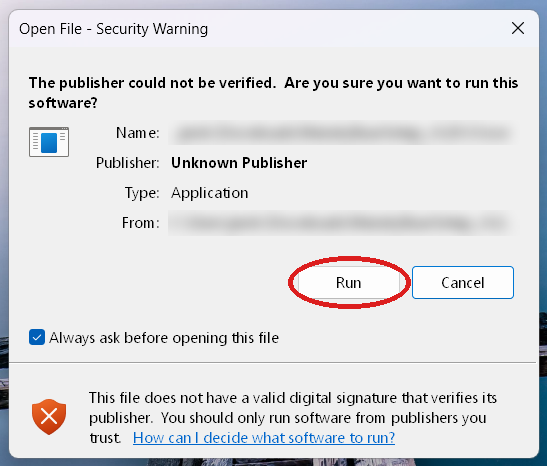
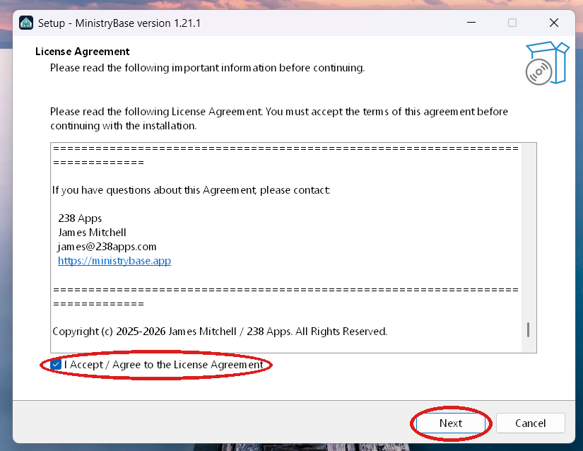
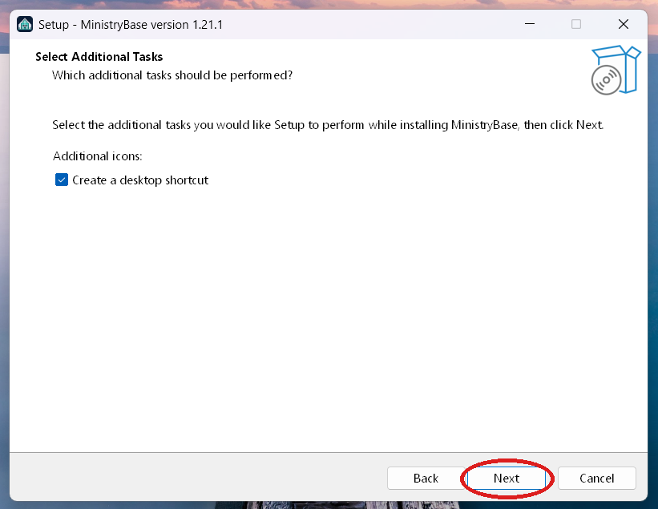
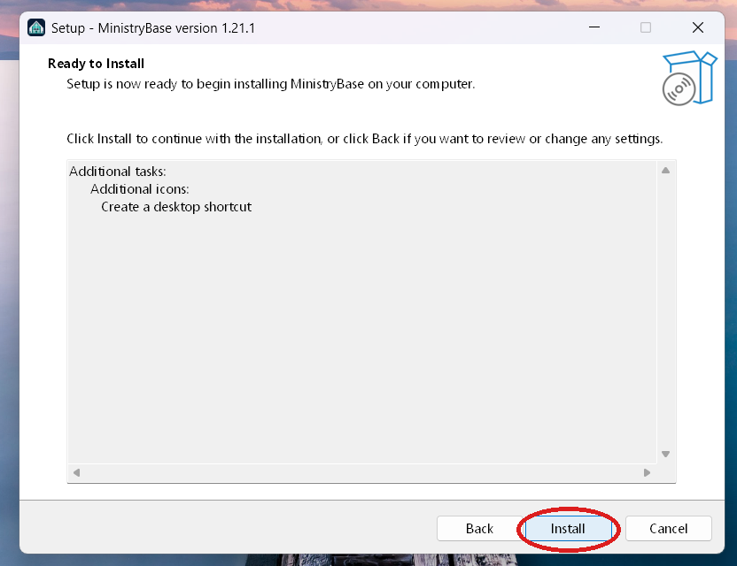
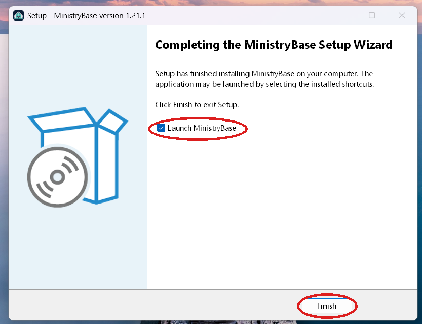

# MinistryBase

**A Windows app for pastors and teachers: your sermons, your calendar, and your members, on your own computer.**

Website: **[ministrybase.app](https://ministrybase.app)** · Download: **[Releases](https://github.com/jmitchell238/MinistryBase-releases/releases)**

MinistryBase keeps your Sunday sermons, Sunday School lessons, Wednesday Bible studies, and newspaper articles in one searchable library. It puts your services on a calendar and keeps your church's member directory alongside them. Everything stays in a folder on your PC. There is no cloud account and no subscription.

> **Beta:** MinistryBase is in public beta. Export a backup before you install a new version: **Settings › Backup & Restore › Export**.

## What's in this release

### The library

- Keep sermons, Sunday School lessons, Wednesday Bible studies, and articles together, each with its title, date, scripture, series, and tags.
- Search by title, scripture reference, or tag. Filter by type or tag, and save the views you use most.
- Attach the Word document, the PDF, or any other file to an entry, and mark one as the manuscript you preach from.
- Group Sunday School and Wednesday lessons into numbered series.
- Mark a message as planned before you deliver it. Entries dated in the future start out planned.

### The calendar

- Your weekly services fill the calendar on their own.
- Add meetings, funerals, weddings, and other events.
- View the month, a week, or a single day. Colors tell sermons, lessons, articles, events, and services apart.
- After a service, record what you preached, the attendance, and a note.

### Members

- A directory of your congregation: phone, email, address, family, and the role each person serves in.
- Birthdays and anniversaries show on the dashboard.
- Only want the library? Turn the calendar or Members off in **Settings › Features**. Nothing is deleted.

### Light or dark

Choose light, dark, or follow Windows in **Settings › Appearance**.

### Coming later

Sermon Studio (writing in the app), bulletins, prayer requests, and teaching schedules are still being finished and are not in this release.

## System requirements

- Windows 10 or Windows 11, 64-bit
- Administrator permission to install
- Disk space for the app and the files you attach
- No internet connection needed to use it

## Installing

**Before you start:** Windows will warn you that the installer is from an unknown publisher. That is expected and safe; see [Windows will warn you first](#windows-will-warn-you-first) below.

1. Go to the **[Releases page](https://github.com/jmitchell238/MinistryBase-releases/releases)** and download the newest installer, named like `MinistryBaseSetup_v1.22.0.1.exe`.

2. Double-click the file. Windows shows a security warning. Click **Run** (or **More info**, then **Run anyway**, as described below).

   

3. **License Agreement:** scroll the agreement all the way to the bottom, tick **I Accept / Agree to the License Agreement**, then click **Next**. Next does nothing until you have scrolled to the end and ticked the box.

   

4. **Additional Tasks:** tick **Create a desktop shortcut** if you want one (it is off by default), then click **Next**.

   

5. **Ready to Install:** click **Install**. Windows may ask for permission to make changes; click **Yes**. The installer also sets up the Microsoft Visual C++ runtime the app needs.

   

6. **Finish:** leave **Launch MinistryBase** ticked and click **Finish**. Later, open MinistryBase from the Start menu (or the desktop shortcut).

   

The app installs to `C:\Program Files\MinistryBase`. Your data is kept separately, in `%LOCALAPPDATA%\MinistryBase`.

## Windows will warn you first

**Every new user sees a warning once, and it is safe to continue.** The installer isn't signed with a paid certificate yet, so Windows doesn't recognize the publisher. Depending on your Windows settings, you will see one of these:

**The "Open File – Security Warning" window** (pictured in step 2 above). It says "The publisher could not be verified" and "Unknown Publisher". Click **Run**.

**Or a blue "Windows protected your PC" box.** It has no Run button at first:

1. Click the small **More info** link under the message.
2. Check that the app is `MinistryBaseSetup_v….exe` and the publisher says **Unknown publisher**.
3. Click **Run anyway**.

**Why it happens:** Windows warns about any downloaded program that isn't code-signed. MinistryBase is free, and a signing certificate costs money every year. The warning means "Windows doesn't know this publisher yet," not "this app is harmful."

**Only download the installer from the [Releases page](https://github.com/jmitchell238/MinistryBase-releases/releases).** If you got it anywhere else, don't run it.

Your browser may also say the file "isn't commonly downloaded". In Edge, open the downloads list, click **…** next to the file, choose **Keep**, then **Show more** and **Keep anyway**.

## First-time setup

The first time you open MinistryBase, a short setup asks for:

1. **Your profile:** your church's name, your name, and your title (for example, Pastor). These show on the dashboard.
2. **Your service schedule:** the services your church holds each week, such as Sunday Morning or Wednesday Evening. They fill the calendar on their own.
3. **A post-service check-in:** whether MinistryBase should ask after each service what you preached and how many attended.
4. **An admin password:** you enter it each time you open the app. You are then given a **recovery code**. Write it down and keep it somewhere safe. It is the only way to reset a forgotten password.

You can change all of this later in **Settings**.

## Updating

Download the newest installer and run it over the old version. You do not need to uninstall first, and your data is kept. See [UPDATING.md](UPDATING.md).

**Updating from 1.21.1 or earlier:** those versions installed to `C:\Program Files (x86)\MinistryBase`. Version 1.22.0 and later install to `C:\Program Files\MinistryBase`, and the installer removes the old copy for you. Your data is not touched. Close MinistryBase first; if the installer says MinistryBase or `ministrybase_mcp.exe` is still running, close it (and any Claude app using MinistryBase) and click **Retry**.

MinistryBase does not check for updates on its own. New versions are posted on the [Releases page](https://github.com/jmitchell238/MinistryBase-releases/releases).

## Your data and backups

- Everything you enter, plus your attached files and settings, lives in `%LOCALAPPDATA%\MinistryBase` on your PC.
- Each save keeps a dated backup, and MinistryBase holds the 10 most recent for each data file.
- **Settings › Backup & Restore** exports your whole library, attached files included, as one zip file. You can import it again on this PC or a new one.

## Uninstalling

Uninstall MinistryBase from **Windows Settings › Apps**, or with **Uninstall MinistryBase** in the Start menu. Uninstalling leaves your data in place. To remove it completely, delete the `%LOCALAPPDATA%\MinistryBase` folder afterward.

## Privacy

Your sermons, calendar, and members stay on your computer. MinistryBase contains no analytics, advertising, or tracking, and it does not send your content anywhere. See [PRIVACY.md](PRIVACY.md).

## License and cost

MinistryBase is free for personal use and for pastors and churches with 100 or fewer people in regular attendance. At a church with more than 100 people in regular attendance, each person who uses it needs a one-time US $101 license (two pastors = $202); email [james@238apps.com](mailto:james@238apps.com) to get one. MinistryBase is proprietary software. See the [Terms of Use](https://ministrybase.app/terms.html), [LICENSE.md](LICENSE.md) and the full [license agreement](EULA.md) shown during installation.

## Contact

- Help and bug reports: [support@238apps.com](mailto:support@238apps.com)
- Privacy questions: [privacy@238apps.com](mailto:privacy@238apps.com)
- Licensing: [james@238apps.com](mailto:james@238apps.com)

---

[ministrybase.app](https://ministrybase.app) · Made by [238 Apps](https://238apps.com)
